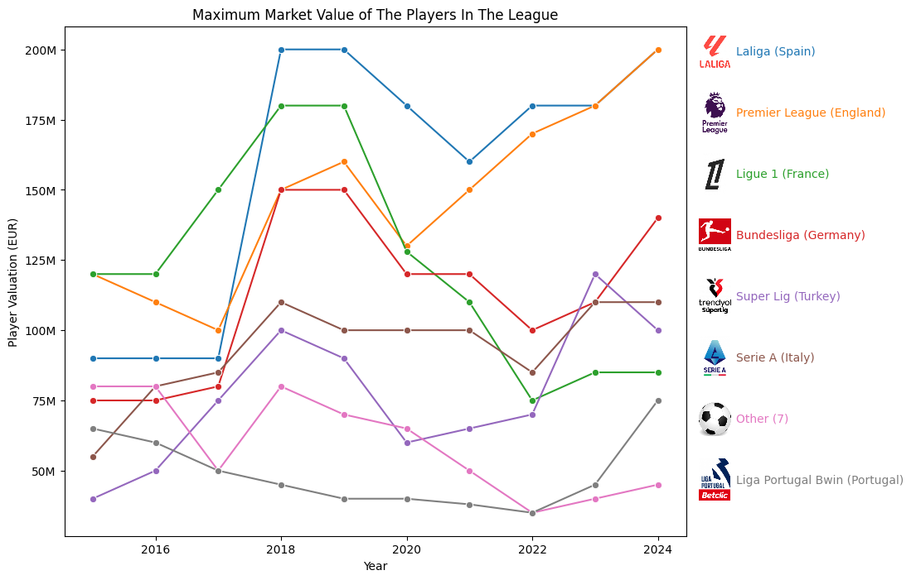

# Dagster University: Football Data Pipeline ⚽

This repository contains the project I completed for the Dagster University course. It demonstrates building a complete, end-to-end data pipeline using Dagster to fetch, process, analyze, and visualize football (soccer) data.

The pipeline ingests data from Kaggle, enriches it by scraping web data, warehouses it in DuckDB, and performs analysis to generate plots on league valuation trends.

-----

## 🚀 Pipeline Features

This project is built entirely as a graph of Dagster assets. Here's a summary of the pipeline's key functions:

  * **Data Ingestion:** Fetches 6 raw datasets (players, clubs, games, appearances, valuations, competitions) from Kaggle using the `kagglehub` library.
  * **File-Based Storage:** Caches the raw and processed data locally as efficient Parquet files.
  * **Time-Series Partitioning:** Implements **monthly partitioning** for the large `player_valuations` and `player_appearances` datasets, allowing for incremental and backfill processing.
  * **Data Warehousing:** Uses a **DuckDB resource** to load all processed data into a local data warehouse. Partitioned tables are loaded idempotently (delete and insert).
  * **Web Scraping:** Includes an asset that scrapes league websites (using `requests` and `BeautifulSoup`) to download and store team logos.
  * **Data Analysis:** An analytical asset calculates the aggregated market valuation for each league on a monthly basis.
  * **Visualization & Reporting:** The final asset queries the analytical data, processes it with `pandas`, and uses `matplotlib` & `seaborn` to generate and save line plots showing the market value evolution of the top leagues.

-----

## 🛠️ Key Dagster Concepts Demonstrated

This project puts several core Dagster concepts into practice:

  * **Software-Defined Assets:** The entire pipeline is declarative, defined using the `@dg.asset` decorator.
  * **Resources:** The pipeline is configured with a `DuckDBResource` to manage the database connection, which is cleanly injected into the assets that need it.
  * **Partitioning:** `partitions_def=monthly_partition` is used to model the time-series nature of the valuation and appearance data. `AssetExecutionContext` is used within assets to access the current partition key.
  * **Asset Dependencies:** A clear dependency graph is established using `deps=[...]`, allowing Dagster to manage the execution order, from fetching raw files to generating final plots.
  * **Integration with the Python Ecosystem:** Shows how to seamlessly integrate tools like `pandas`, `kagglehub`, `duckdb`, `requests`, `beautifulsoup4`, and `matplotlib` into a robust data pipeline.

-----

## 📊 Pipeline Asset Breakdown

The pipeline is composed of several groups of assets, each with a specific responsibility.

### 1\. Ingestion & Raw Files

These assets use `kagglehub.load_dataset` to download data and save it as a "raw" Parquet file.

  * `football_player_valuations_file`
  * `football_player_appearances_file`
  * `football_competitions_file`
  * `football_players_file`
  * `football_clubs_file`
  * `football_games_file`

### 2\. Monthly Partitioning

These assets read the large, raw files and split them into smaller, monthly Parquet files based on their date.

  * `monthly_player_valuations`
  * `monthly_player_appearances`

### 3\. DuckDB Warehouse

These assets take the Parquet files (both partitioned and unpartitioned) and load them into tables in a central DuckDB database.

  * `player_valuations_db` (partitioned)
  * `player_appearances_db` (partitioned)
  * `football_competitions_db`
  * `football_players_db`
  * `football_clubs_db`
  * `football_games_db`

### 4\. Enrichment

This asset queries the database for league URLs and scrapes their logos.

  * `league_logos`

### 5\. Analysis & Reporting

These assets perform the final analysis and create the visual outputs.

  * `league_valuation_evolution_db`: Queries the main DB, aggregates player valuations by league and month, and saves the results to a new table.
  * `first_league_valuation`: The final asset. It queries the aggregated data, processes it with `pandas`, and uses a custom `plot_leagues` utility to generate the two plots shown in the next section.

-----

## 📈 Pipeline Output & Analysis

The final outputs of this pipeline are two graphs that analyze the market value of top football leagues.

### Total League Valuation


This plot shows the aggregated market value of all players within each league.

**Analysis:** The **Premier League (England)** shows clear and growing financial dominance, separating itself from all other leagues, especially after 2018. A competitive second tier consists of **LaLiga (Spain)**, **Serie A (Italy)**, and the **Bundesliga (Germany)**, which have much closer total valuations.

### Maximum Player Valuation


This plot shows the market value of the single most valuable player in each league for a given year.

**Analysis:** This graph tells a different story. While the Premier League has the highest *total* value, the world's *individual* superstars are more distributed. **Ligue 1 (France)** and **LaLiga (Spain)** show the highest individual player peaks (around €200M), likely corresponding to the peak valuations of players like Kylian Mbappé and Lionel Messi. This suggests that while England has the most depth and overall wealth, the most valuable "marquee" players have historically been spread across Europe's top leagues.

-----

## 🏃‍♂️ How to Run

1.  **Install Dependencies (with `uv`):**
    This project uses `uv` for package management. Dependencies are defined in `project.toml`.

    ```bash
    # Create a virtual environment
    uv venv

    # Activate the environment
    # (On macOS/Linux)
    source .venv/bin/activate
    # (On Windows PowerShell)
    .venv\Scripts\Activate.ps1

    # Install the project and its dependencies
    uv pip install -e .
    ```

2.  **Run Dagster:**

    ```bash
    dagster dev
    ```

3.  **Materialize Assets:**
    Open the Dagit UI (usually at `http://127.0.0.1:3000`), navigate to the asset graph, and materialize the final `first_league_valuation` asset. Dagster will automatically orchestrate and run all the necessary upstream assets. The final plots will be saved in the `data/outputs/` directory.